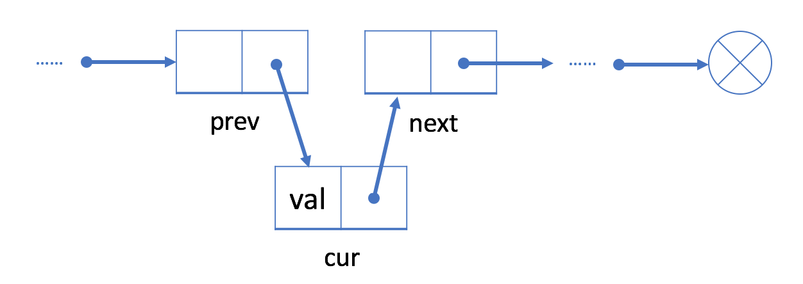

# 链表

链表（Linked List）是一种常见的基础数据结构，是一种线性表，但是并不会按线性的顺序存储数据，而是在每一个节点里存到下一个节点的指针（Pointer）。


由于不必须按顺序存储，链表在插入的时候可以达到 O(1) 的复杂度，比另一种线性表 —— 顺序表快得多，但是查找一个节点或者访问特定编号的节点则需要 O(n) 的时间，而顺序表相应的时间复杂度分别是 O(log n) 和 O(1)。

使用链表结构可以克服数组链表需要预先知道数据大小的缺点，链表结构可以充分利用计算机内存空间，实现灵活的内存动态管理。但是链表失去了数组随机读取的优点，同时链表由于增加了结点的指针域，空间开销比较大。

在计算机科学中，链表作为一种基础的数据结构可以用来生成其它类型的数据结构。链表通常由一连串节点组成，每个节点包含任意的实例数据（data fields）和一或两个用来指向上一个/或下一个节点的位置的链接（links）。链表最明显的好处就是，常规数组排列关联项目的方式可能不同于这些数据项目在记忆体或磁盘上顺序，数据的访问往往要在不同的排列顺序中转换。而链表是一种自我指示数据类型，因为它包含指向另一个相同类型的数据的指针（链接）。

链表允许插入和移除表上任意位置上的节点，但是不允许随机存取。链表有很多种不同的类型：单向链表，双向链表以及循环链表。

链表通常可以衍生出循环链表，静态链表，双链表等。对于链表使用，需要注意头结点的使用。

以上内容来自[力扣（LeetCode）](https://leetcode-cn.com/tag/linked-list/)

# 添加操作

## 单链表

如果我们想在给定的结点 `prev` 之后添加新值，我们应该：

1.  使用给定值初始化新结点 `cur；`

   

2. 将 `cur `的“next”字段链接到 prev 的下一个结点 `next`；

   

3. 将 `prev` 中的“next”字段链接到 `cur` 。

   

### 代码表示

```javascript 
cur.next = prev.next
prev.next = cur
```


## 双链表

如果我们想在现有的结点 `prev` 之后插入一个新的结点 `cur`，我们可以将此过程分为两个步骤：

1. 链接 `cur` 与 `prev` 和 `next`，其中 `next` 是 `prev` 原始的下一个节点；

   

2. 用 `cur` 重新链接 `prev` 和 `next`。

   

### 代码表示

```javascript 
//1
cur.next = prev.next
cur.prev = prev
//2
prev.next = cur
next.prev = cur
```


# 删除操作

## 单链表

如果我们想从单链表中删除现有结点 `cur`，可以分两步完成：

1. 找到 cur 的上一个结点 `prev` 及其下一个结点 `next；`

   

2. 接下来链接 `prev` 到 cur 的下一个节点 `next。`

   

### 代码表示

```javascript
prev.next = cur.next
OR
prev.next = prev.next.next
```


## 双链表

如果我们想从双链表中删除一个现有的结点 `cur`，我们可以简单地将它的前一个结点 `prev` 与下一个结点 `next` 链接起来。

### 代码表示

```javascript
prev.next = cur.next //或者 prev.next = prev.next.next
next.prev = prev
```

以上内容除代码表示外，都来自[力扣（LeetCode）](https://leetcode-cn.com/explore/learn/card/linked-list/)
