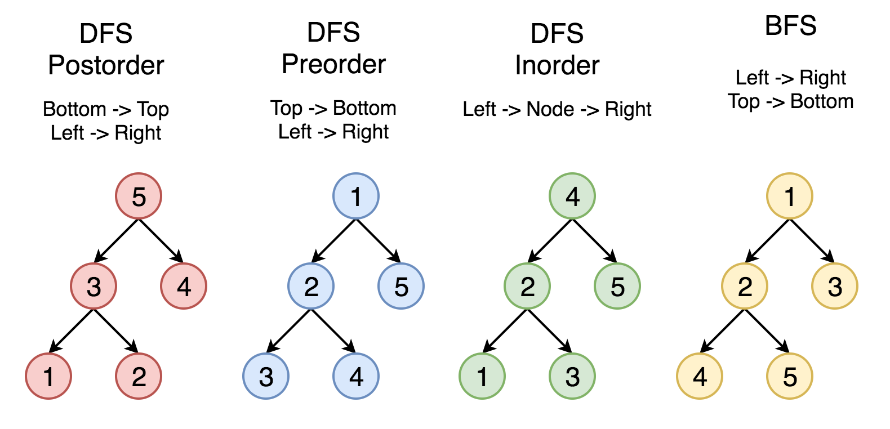

# 概念

树是一种抽象数据类型（ADT）或是实现这种抽象数据类型的数据结构，用来模拟具有树状结构性质的数据集合。它是由 n(n>0) 个有限节点组成一个具有层次关系的集合。


把它叫做「树」是因为它看起来像一棵倒挂的树，也就是说它是根朝上，而叶朝下的。

它具有以下的特点：

- 每个节点都只有有限个子节点或无子节点；
- 没有父节点的节点称为根节点；
- 每一个非根节点有且只有一个父节点；
- 除了根节点外，每个子节点可以分为多个不相交的子树；
- 树里面没有环路。

以上内容来自

链接：https://leetcode-cn.com/tag/tree/
来源：力扣（LeetCode）
著作权归作者所有。商业转载请联系作者获得授权，非商业转载请注明出处。

# **之后内容，会把树的搜索方法基础办法一一列举出来，有了这些方法，绝大多数有关树的算法，都能迎刃而解。**

# 二叉树

## 二叉树DFS，BFS图解



# 深度优先搜索

## 二叉树的前序遍历

### root，left，right的相对顺序遍历

### 递归

```javascript
/**
 * Definition for a binary tree node.
 * function TreeNode(val) {
 *     this.val = val;
 *     this.left = this.right = null;
 * }
 */
/**
 * @param {TreeNode} root
 * @return {number[]}
 */
var preorderTraversal = function(root) {
    if (root !== null) {
        return [root.val,...preorderTraversal(root.left),...preorderTraversal(root.right)];
    }
    return [];
};
//------------------------------------------------
var preorderTraversal = function(root) {
    let res = [];
    const getResult = (root)=>{
        if(!root) return;
        res.push(root.val);
        if(root.left) getResult(root.left);
        if(root.right) getResult(root.right);
    }
    getResult(root);
    return res;
};
```

### 迭代

```javascript
var preorderTraversal = function(root) {
    let res = [];
    if(!root) return res;

    let stack = [];
    stack.push(root);
    while(stack.length > 0){
        const node = stack.pop();
        res.push(node.val);
	      if(node.right) stack.push(node.right);
        if(node.left) stack.push(node.left);
    }
    return res;
};
```


## 二叉树的中序遍历

### left，root，right的相对顺序遍历

### 递归

```javascript
/**
 * Definition for a binary tree node.
 * function TreeNode(val) {
 *     this.val = val;
 *     this.left = this.right = null;
 * }
 */
/**
 * @param {TreeNode} root
 * @return {number[]}
 */
var inorderTraversal = function(root) {
    if (root) {
        return [...inorderTraversal(root.left),root.val,...inorderTraversal(root.right)];
    }
    return [];
};
//------------------------------------------------
var inorderTraversal = function(root) {
    let res = [];
    const getResult = (root) =>{
        if(!root) return;
        if(root.left) getResult(root.left);
        res.push(root.val);
        if(root.right) getResult(root.right);

    }
    getResult(root);
    return res;
};

```

### 迭代

```javascript
var inorderTraversal = function(root) {
    let res = [];
    if(!root) return res;

    let stack = [];
    let cur = root;
    while(cur != null || stack.length>0){
        while(cur != null){
            stack.push(cur);
            cur = cur.left;
        }
        cur = stack.pop();
        res.push(cur.val);
        cur = cur.right;
    }

    return res;
};
```


## 二叉树的后序遍历

### left，right，root的相对顺序遍历

### 递归

```javascript 
/**
 * Definition for a binary tree node.
 * function TreeNode(val) {
 *     this.val = val;
 *     this.left = this.right = null;
 * }
 */
/**
 * @param {TreeNode} root
 * @return {number[]}
 */
var postorderTraversal = function(root) {
    if(root !== null){
        return [...postorderTraversal(root.left),...postorderTraversal(root.right),root.val];
    }
    return [];
};
//------------------------------------------------
var postorderTraversal = function(root) {
    let res = [];
    const getResult = (root)=>{
        if(!root) return;
        if(root.left) getResult(root.left);
        if(root.right) getResult(root.right);
        res.push(root.val);
    }
    getResult(root);
    return res;
};

```

### 迭代

```javascript
var postorderTraversal = function(root) {
    let res = [];
    if(!root) return res;

    let stack = [];
    stack.push(root);
    while(stack.length > 0){
        const node = stack.pop();
        res.unshift(node.val);
        if(node.left) stack.push(node.left);
        if(node.right) stack.push(node.right);
    }

    return res;
};
```

# 宽度优先搜索

## 二叉树的层序遍历

### 递归

```javascript
/**
 * Definition for a binary tree node.
 * function TreeNode(val) {
 *     this.val = val;
 *     this.left = this.right = null;
 * }
 */
/**
 * @param {TreeNode} root
 * @return {number[][]}
 */
var levelOrder = function(root) {
    const res = [];
    const getResult = (root,level)=>{
        if(!root) return;
        if(res.length <= level){
            res.push([]);
        }
        res[level].push(root.val);
        if(root.left) getResult(root.left,level+1);
        if(root.right) getResult(root.right,level+1);
    }
    getResult(root,0);
    return res;
};
```

### 迭代

```javascript
var levelOrder = function(root) {
    const ret = [];
    if (!root) return ret;

    const q = [];
    q.push(root);
    while (q.length !== 0) {
        const len = q.length;
        ret.push([]);
        while (len > 0) {
            const node = q.shift();
            ret[ret.length - 1].push(node.val);
            if (node.left) q.push(node.left);
            if (node.right) q.push(node.right);
            len--;
        }
    }
        
    return ret;
};
```

# N叉树

## N叉树的前序遍历

### 递归

```javascript 
/**
 * // Definition for a Node.
 * function Node(val, children) {
 *    this.val = val;
 *    this.children = children;
 * };
 */

/**
 * @param {Node} root
 * @return {number[]}
 */
var preorder = function(root) {
    let res = [];
    function getResult(root){
        if(!root) return;
        res.push(root.val);
        root.children.forEach(child=>{
            getResult(child);
        })
    }
    getResult(root);
    return res;
};
//------------------------------------------------
var preorder = function(root) {
    let res = [];
    if(root){
        res.push(root.val);
        root.children.forEach(child=>{
            res.push(...preorder(child));
        })      
    }
    return res;
};
```

### 迭代

```javascript
var preorder = function(root) {
    let res = [];
    if(root){
        let stack = [root];
        while(stack.length > 0){
            const node = stack.shift();
            res.push(node.val);
            for(let i=node.children.length-1;i>=0;i--){
                stack.unshift(node.children[i]);
            }
        }
    }
    return res;
};
```

## N叉树的后序遍历

### 递归

```javascript 
/**
 * // Definition for a Node.
 * function Node(val,children) {
 *    this.val = val;
 *    this.children = children;
 * };
 */

/**
 * @param {Node} root
 * @return {number[]}
 */
var postorder = function(root) {
    let res = [];
    function getResult(root){
        if(!root) return;
        root.children.forEach(child=>{
            getResult(child);
        })
        res.push(root.val);
    }
    getResult(root);
    return res;
};
//------------------------------------------------
var postorder = function(root) {
    let res = [];
    if(root){
        root.children.forEach(child=>{
            res.push(...postorder(child));
        })   
        res.push(root.val);   
    }
    return res;
};

```

### 迭代

```javascript 
var postorder = function(root) {
    let res = [];
    if(root){
        let stack = [root];
        while(stack.length > 0){
            let len = stack.length;
            while(len > 0){
                const node = stack.pop();
                res.unshift(node.val);
                if(node.children) {
                    node.children.forEach((child)=>{
                        stack.push(child);
                    })
                }
                len--;
            }
        }
    }
    return res;
};
```

## N叉树的层序遍历

### 递归

```javascript
/**
 * // Definition for a Node.
 * function Node(val,children) {
 *    this.val = val;
 *    this.children = children;
 * };
 */

/**
 * @param {Node} root
 * @return {number[][]}
 */
var levelOrder = function(root) {
    let res = [];
    const getResult = (root,level)=>{
        if(!root) return;
        if(res.length <= level){
            res.push([])
        }
        res[level].push(root.val);
        root.children.forEach((child)=>{
            getResult(child,level+1);
        })
    }
    getResult(root,0);
    return res;
};
```

### 迭代

```javascript
var levelOrder = function(root) {
    let res = [];
    if(root){
        let stack = [root];
        while(stack.length>0){
            let len = stack.length;
            let level = [];
            while(len > 0){
                let node = stack.shift()
                level.push(node.val);
                if(node.children){
                    stack.push(...node.children);
                }
                len--;
            }
            res.push(level);
        }
    }
    return res;
};
```

